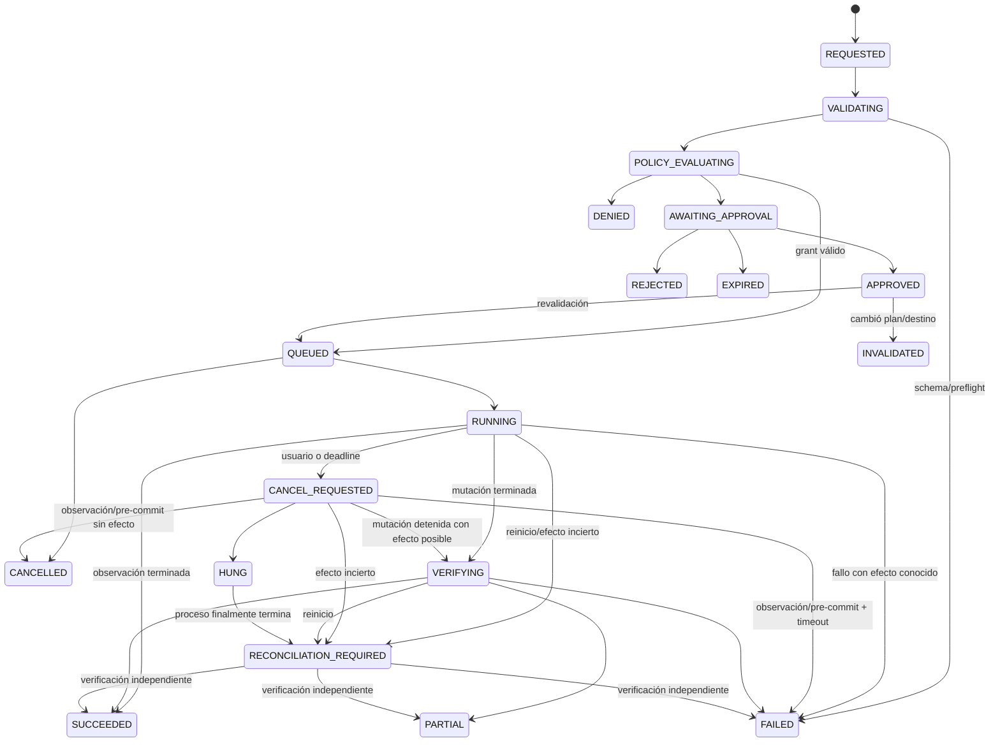

# Agente y sistema de herramientas

> Estado: contrato aprobado, todavía no implementado. Ninguna herramienta Linux ni conexión con Ollama está habilitada en el slice fundacional.

## 1. Principio

El LLM es un planificador probabilístico no confiable. Puede solicitar una herramienta por nombre con argumentos JSON; no puede ejecutar, aprobar, elegir privilegios, crear comandos ni declarar que una operación tuvo éxito. El Tool Manager y la política son autoritativos.

## 2. Contrato de herramienta

Cada herramienta versionada expone una especificación inmutable:

```text
ToolSpec
├── name + semantic_version + spec_hash
├── description + category
├── input_schema + output_schema
├── effect: OBSERVE | CHANGE | DESTRUCTIVE
├── risk: LOW | MEDIUM | HIGH | CRITICAL
├── allowed_modes + required_capabilities
├── approval_policy
├── timeout + max_output_bytes + concurrency_key
├── idempotent + cancellability + supports_dry_run
└── verifier_tool
```

La responsabilidad se divide en tres contratos. La API solo prepara una propuesta sin comandos; el broker reconstruye y ejecuta su propio plan; la verificación es otra tool versionada:

```python
class ToolDefinition(Protocol[InputT]):
    spec: ToolSpec
    input_model: type[InputT]

    async def prepare(
        self, context: PreparationContext, params: InputT
    ) -> ProposedAction: ...  # args/destinos/precondiciones/resumen; nunca argv


class BrokerHandler(Protocol[InputT, OutputT]):
    spec_hash: str

    async def preflight(
        self, context: BrokerContext, invocation: CanonicalInvocation[InputT]
    ) -> BrokerPlan: ...  # revalida y construye argv internamente

    async def execute(self, context: BrokerContext, plan: BrokerPlan) -> ToolResult[OutputT]: ...
```

`ToolSpec.verifier_tool` referencia otra `tool@version`, con handler, resultado y evidencia propios; una mutación no puede autoatestiguar éxito desde su método `execute`. Los modelos Pydantic usan modo estricto y `extra="forbid"`, límites, enums y tipos semánticos. No se aceptan strings libres para dispositivos, rutas, ejecutables o flags. Separar siempre consulta y reparación: `filesystem.check` y `filesystem.repair` son herramientas diferentes.

El registry es un mapa explícito `name@version → factory`, restringido además por `enabled_tools` y por un hash incorporado en la imagen. Falla cerrado ante duplicados, versiones inesperadas, manifiesto modificado o binario inseguro. No usa imports dinámicos ni entry points instalables.

## 3. Política y aprobación

La política recibe sujeto, sesión, modo, spec, parámetros canónicos, destinos, grants, precondiciones y estado. Devuelve únicamente:

```text
ALLOW | REQUIRE_APPROVAL | DENY
```

con código y motivos estables. Un `ALLOW` siempre procede de un `capability_grant` autoritativo del broker, emitido por el consent agent, no revocado/expirado y con usos. Liga identidad PAM/FIDO2, auth session, caso y `tool@version`; el broker consume uso atómicamente antes de ejecutar. La fila SQLite es solo una proyección y no concede permisos.

Para una mutación, el broker crea el desafío y el consent agent produce la decisión en el TTY seguro, fuera de FastAPI. La aprobación contiene:

```text
nonce, user_id, session_id, case_id, invocation_id,
tool@version, spec_hash, canonical_args_hash, plan_hash,
target_identities, inventory_snapshot, risk, effect, mode,
issued_at, expires_at, auth_strength, consent_agent_id, status
```

Es de un solo uso y el nonce/clave viven en el broker, no en la API. Se consume con comparación atómica; después se revalidan identidad y precondiciones. Cualquier cambio crea otro desafío. FastAPI puede pedir que se muestre el diálogo o registrar un rechazo, pero no fabricar `APPROVED`.

## 4. Estados



Este es el enum canónico de invocación; API, DB, SSE y UI usan exactamente estos nombres. Terminales: `DENIED`, `REJECTED`, `EXPIRED`, `INVALIDATED`, `SUCCEEDED`, `PARTIAL`, `FAILED` y `CANCELLED`. `HUNG` y `RECONCILIATION_REQUIRED` no son terminales: conservan el lock y bloquean acciones incompatibles.

No existe estado `TIMED_OUT`: el deadline genera `CANCEL_REQUESTED`. Solo una observación o una mutación detenida antes de su punto de commit, con ausencia de efecto demostrada, puede acabar `CANCELLED`/`FAILED` con `TOOL_TIMEOUT`. Si una mutación pudo tener efecto, va a `VERIFYING` cuando el proceso terminó de forma conocida o a `RECONCILIATION_REQUIRED` si hay incertidumbre; si el proceso no termina, `HUNG`. Nunca se reintenta automáticamente. Cada transición se persiste antes del efecto externo y genera un evento.

## 5. Ciclo del agente

```text
comprender → reunir evidencia → formular hipótesis → pedir evidencia adicional
→ diagnóstico sustentado → proponer solución → esperar aprobación
→ ejecutar → verificar → informar
```

El orquestador impone presupuesto de tiempo, turnos, herramientas, repeticiones y salida. Las llamadas de mutación se serializan. Cada afirmación técnica debe referenciar `evidence_id`/`invocation_id`; si la evidencia no basta, el estado es `unknown`, no una suposición.

Perfiles de modelo:

```text
model_id + digest, roles permitidos, capacidad de tool calling,
capacidad de JSON Schema, ventana de contexto, coste RAM/VRAM,
opciones fijadas y confianza permitida
```

El servidor elige el perfil. No supone que todos los modelos Qwen, Gemma, Llama o Phi tienen las mismas capacidades. Ollama puede devolver tool calls, pero ARES los vuelve a validar y nunca habilita autoejecución. Temperatura baja, salidas estructuradas y un modelo falso determinista son obligatorios en pruebas.

## 6. Datos hostiles y evidencia

Toda salida del sistema es `UNTRUSTED_DATA`. Se parsea a estructuras conocidas, se normalizan caracteres de control, se limita el tamaño y se conserva el original como artefacto con hash cuando sea necesario. El LLM recibe hechos mínimos con procedencia, no stdout sin delimitar. Un volumen llamado “Ignore previous instructions” sigue siendo solo una etiqueta.

El detector de prompt injection puede alertar, pero no es la frontera de seguridad. La protección real es registry + schema + policy + aprobación + broker.

## 7. Primera herramienta prevista

`storage.list_block_devices@1` será la primera vertical slice del runtime:

- efecto `OBSERVE`, riesgo `LOW`, modo `READ_ONLY`;
- sin parámetros libres;
- ejecuta una invocación fija de `/usr/bin/lsblk` con JSON, bytes, paths y columnas explícitas;
- sin privilegios, timeout de 5 s, salida máxima de 1 MiB;
- parsea a un resultado plano tipado con identidad y relaciones;
- requiere grant de lectura de la sesión;
- registra solicitud, política, ejecución, resultado y evidencia.

Pruebas mínimas: herramienta desconocida, argumento extra/inyección, falta o expiración del grant, timeout, límite de salida, salida hostil, identidad cambiante, cancelación y auditoría.

## 8. Catálogo objetivo

Los nombres finales se versionarán; esta matriz impide agrupar lectura y reparación bajo una bandera ambigua.

| Tool prevista | Efecto / riesgo inicial | Modo y controles adicionales |
|---|---|---|
| `storage.list_block_devices` | OBSERVE / LOW | READ_ONLY; `lsblk` JSON fijo |
| `storage.list_partitions` | OBSERVE / LOW | READ_ONLY; snapshot e identidad estable |
| `storage.read_smart` | OBSERVE / LOW | READ_ONLY; `smartctl` con dispositivo inventariado |
| `system.read_logs` | OBSERVE / LOW | READ_ONLY; `journalctl` con unidades/rango/bytes enumerados |
| `system.inspect_service` | OBSERVE / LOW | READ_ONLY; campos fijos de `systemctl show`, sin start/stop |
| `filesystem.check` | OBSERVE / MEDIUM | READ_ONLY; filesystem desmontado o snapshot, flags no modificadores |
| `filesystem.unmount_managed` | CHANGE / HIGH | REPAIR; solo mount IDs creados por ARES, `umount` interno y lock |
| `storage.backup_partition` | CHANGE / HIGH | REPAIR; destino administrado, capacidad, hash y verificación |
| `recovery.recover_files` | CHANGE / HIGH | REPAIR; fuente solo lectura y destino ARES separado |
| `filesystem.repair` | CHANGE / HIGH o CRITICAL | REPAIR; implementación específica ext/NTFS/Btrfs/XFS, backup y verifier |
| `boot.repair_grub` | DESTRUCTIVE / CRITICAL | ADVANCED; BIOS/UEFI explícito, chroot controlado y exclusión del USB Live |
| `memory.diagnose` | OBSERVE / MEDIUM | READ_ONLY; presupuesto de RAM/tiempo y posible fase de arranque aparte |
| `network.diagnose` | OBSERVE / MEDIUM | READ_ONLY; destinos/paquetes permitidos y consentimiento de red |

`parted`, `fdisk`, `mount`, `umount`, `testdisk`, `rsync`, `journalctl`, `systemctl`, `fsck`, `ntfsfix`, `btrfs`, `xfs_repair`, `grub-install` y `update-grub` son detalles internos de implementaciones específicas. Nunca se exponen como una herramienta de comando libre; las operaciones mutables de `systemctl` quedan fuera del catálogo v1.
