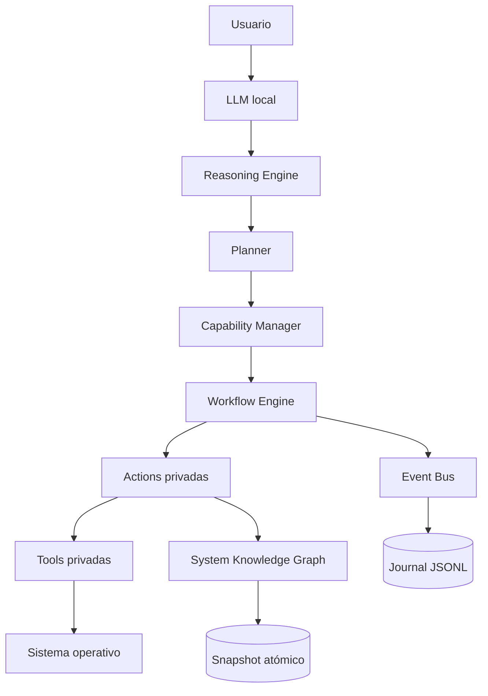
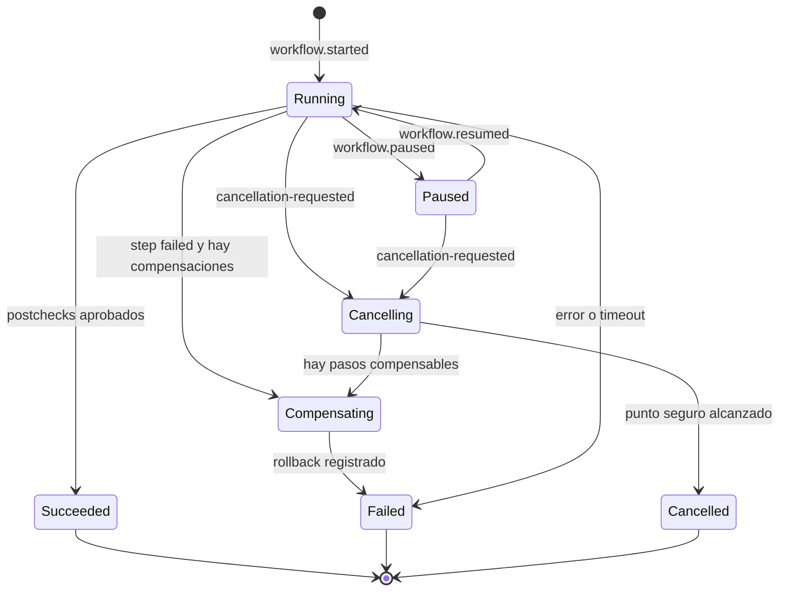
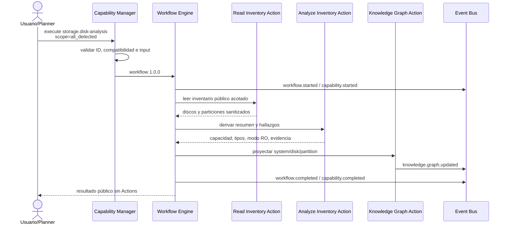

# ARES v2: arquitectura orientada a Capabilities

## Alcance de esta fase

ARES deja de exponer herramientas aisladas y pasa a administrar el equipo
mediante **Capabilities** de alto nivel. Una Capability expresa un objetivo,
riesgo, permisos, evidencia, verificaciones y estrategia de recuperación; sus
Actions y Tools son detalles privados.

Esta fase entrega el núcleo extensible y una sola Capability completa:
`storage.disk-analysis` versión `1.0.0`. No implementa aún reparaciones,
particionado, SMART activo ni cambios sobre discos.

El LLM puede explicar un objetivo o interpretar resultados, pero no recibe
comandos, Tools ni Actions. El Reasoning Engine solo devuelve hipótesis,
evidencia faltante y, como máximo, el identificador de una Capability. La
ejecución requiere todavía que el Capability Manager valide el contrato y
construya un workflow controlado por el servidor.

## Responsabilidades y fronteras

| Componente | Responsabilidad | No puede hacer |
|---|---|---|
| LLM | Conversar, resumir evidencia y resultados | Elegir comandos, rutas o argumentos |
| Reasoning Engine | Hipótesis, confianza, evidencia y selección de Capability | Ejecutar Capabilities o conocer Actions |
| Planner | Encadenar objetivos y dependencias entre Capabilities | Saltarse riesgo, permisos o modo Live |
| Capability Manager | Descubrir, validar, buscar, documentar y despachar Capabilities | Ejecutar Tools directamente |
| Workflow Engine | Secuencia, paralelismo, condiciones, reintentos y compensaciones | Aceptar un programa o shell del cliente |
| Action | Operación interna con entrada tipada y acotada | Ser invocada desde la API o por el LLM |
| Tool | Adaptador final a una biblioteca, archivo o proceso fijo | Formar parte del catálogo público |
| Event Bus | Persistir antes de entregar eventos | Permitir una acción sin evidencia durable |
| Knowledge Graph | Mantener hechos y relaciones observados | Inventar evidencia ausente |

La API pública filtra los identificadores de Actions. El journal interno sí los
registra para que una auditoría pueda reconstruir cada paso.

## Contrato de una Capability

Todos los metadatos se validan al arrancar y son inmutables durante la sesión:

| Campo | Finalidad |
|---|---|
| `id`, `version`, `name` | Identidad estable y versionada |
| `description`, `objective`, `keywords` | Búsqueda y documentación automática |
| `category` | Clasificación funcional estable |
| `operation` | `observe`, `change` o `recover` |
| `os_compatibility` | Familia, arquitectura, versión mínima y modos Live |
| `risk` | `low`, `medium`, `high` o `critical` |
| `estimated_duration_seconds` | Presupuesto visible de tiempo |
| `permissions` | Permisos semánticos con justificación |
| `dependencies` | Otras Capabilities requeridas |
| `internal_actions` | Plan privado inspeccionable por el núcleo |
| `postchecks` | Invariantes que deben cumplirse después de las Actions |
| `rollback` | Compensación disponible o razón por la que no aplica |
| `required_evidence` | Hechos mínimos antes de seleccionarla |
| `emitted_events`, `metrics`, `audit` | Observabilidad y retención |

Una Capability no tiene una función para ejecutar comandos. Solo valida su
entrada semántica y produce una definición de workflow.

## Capability Manager y plugins

El ciclo de inicio es:

1. Descubrir proveedores de plugins confiables incluidos en la imagen firmada.
2. Validar el manifiesto, versión de API del núcleo y compatibilidad.
3. Comparar las Capabilities descubiertas con las declaradas.
4. Verificar que cada permiso de una Capability exista en el manifiesto.
5. Resolver dependencias de plugins y Capabilities.
6. Sellar el registro antes de aceptar solicitudes.
7. Publicar un catálogo buscable construido solo con metadatos.

No se importa Python arbitrario desde una memoria USB o un directorio
escribible. La instalación dinámica futura será mediante bundles firmados,
versionados y promovidos a un directorio inmutable; después se reiniciará el
servicio para repetir el ciclo anterior. Esto permite añadir Capabilities sin
modificar el núcleo, sin convertir el descubrimiento en ejecución de código no
confiable.

Cada manifiesto declara como mínimo:

- identificador y versión;
- versión de API del núcleo;
- compatibilidad de sistema;
- dependencias;
- permisos máximos;
- Capabilities expuestas.

## Workflow Engine

Una definición contiene stages y cada stage contiene pasos. Un stage puede ser
secuencial o paralelo. Un paso contiene una Action privada, fábrica de entrada,
condición, timeout, política de reintentos, postchecks y política de
compensación.

El motor implementa:

- pasos secuenciales y stages paralelos;
- condiciones y bifurcaciones mediante pasos condicionados;
- reintentos acotados solo para Actions idempotentes;
- timeout por Action;
- solicitud de cancelación incluso durante una Action;
- pausa y reanudación en puntos seguros;
- compensación inversa de pasos completados;
- rollback registrado, incluso cuando una compensación falla;
- postchecks asíncronos;
- códigos de error estables sin excepciones privadas;
- registro durable de inicio, intentos, resultado, controles y métricas.

Un fallo del journal impide iniciar una ejecución no auditable. Los controles
producen `workflow.paused`, `workflow.resumed` y
`workflow.cancellation-requested`.

Los eventos y recibos criptográficos del resultado viven en
`/var/lib/ares/capabilities/events.jsonl`. El recibo registra SHA-256, tamaño y
campos de nivel superior sin duplicar inventarios extensos. El API conserva una
proyección acotada de las últimas ejecuciones de la sesión; el journal y las
revisiones del grafo son la evidencia durable y autoritativa.

## Reasoning Engine

El componente es independiente del LLM y del Workflow Engine. Recibe:

- objetivo normalizado;
- referencias a evidencia y nivel de confianza;
- catálogo público ya filtrado por compatibilidad.

Produce:

- hipótesis con confianza;
- evidencia faltante;
- una Capability seleccionada, o
- una decisión explícita de detenerse.

La primera implementación es determinista y conservadora: busca coincidencias
en metadatos, exige la evidencia declarada y nunca dispara la ejecución. Una
evolución posterior puede sustituir el algoritmo sin cambiar el contrato ni
dar al modelo acceso a Tools.

## System Knowledge Graph

El schema inicial contempla nodos:

`system`, `hardware`, `cpu`, `ram`, `gpu`, `disk`, `partition`,
`operating_system`, `kernel`, `driver`, `service`, `process`, `user`,
`network`, `firewall`, `package`, `log`, `error` y `event`.

Los nodos tienen ID estable, tipo, atributos sanitizados y fecha de
observación. Las aristas tienen origen, relación y destino. Cada lote:

1. valida que las aristas solo apunten a nodos conocidos;
2. genera una nueva revisión en memoria temporal;
3. escribe y sincroniza un snapshot privado;
4. reemplaza el snapshot de forma atómica;
5. publica `knowledge.graph.updated`.

Si falla la persistencia, la revisión en memoria tampoco avanza. El snapshot
se guarda en `/var/lib/ares/capabilities/knowledge-graph.json` con modo `0600`.

## Event Bus

Los nombres son minúsculos, versionables y orientados al dominio:

- `workflow.started`, `workflow.completed`, `workflow.failed`;
- `workflow.paused`, `workflow.resumed`, `workflow.cancelled`;
- `action.started`, `action.completed`, `action.failed`;
- `workflow.postcheck.passed`;
- `workflow.rollback.started`, `workflow.compensation.completed`;
- `capability.started`, `capability.completed`, `capability.failed`;
- `knowledge.graph.updated`.

Cada evento contiene ID, timestamp UTC, fuente, `correlation_id` y payload
acotado. Se escribe y hace `fsync` antes de notificar suscriptores. Los eventos
de dominio futuros, por ejemplo `storage.disk-detected`,
`storage.smart-warning`, `backup.finished` o `firewall.modified`, seguirán el
mismo sobre.

## Capability de referencia: Disk Analysis

### Contrato

- ID: `storage.disk-analysis`
- Versión: `1.0.0`
- Operación: `observe`
- Riesgo: `low`
- Entrada pública única: `{"scope": "all_detected"}`
- Evidencia requerida: `hardware.block-devices`
- Rollback: no requerido; no modifica el equipo

No se aceptan paths, nombres de dispositivo, ejecutables, argumentos ni shell.
El backend mantiene `PrivateDevices=yes`; no abre discos. Consume únicamente
`/run/ares/hardware/public/inventory-v1.json`, generado y redactado por el
servicio privilegiado de hardware durante el arranque.

### Flujo

El resultado contiene resumen, discos/particiones sanitizados, hallazgos,
referencia de evidencia y revisión del grafo. Que SMART no haya sido evaluado
se informa como evidencia faltante; nunca se interpreta como “disco sano”.

Fallos estables principales:

- `DISK_INVENTORY_UNAVAILABLE`
- `DISK_INVENTORY_TOO_LARGE`
- `DISK_INVENTORY_INVALID`
- `DISK_ANALYSIS_INPUT_INVALID`
- `POSTCHECK_FAILED`
- `ACTION_TIMEOUT`

## Catálogo objetivo

Solo Disk Analysis está implementada. El catálogo futuro se organiza así:

- **Storage:** Partition Management, Disk Clone, Disk Migration, Filesystem
  Repair/Conversion, SMART Analysis, Secure Erase, Recovery y Partition
  Recovery.
- **Backup:** Snapshot, Incremental/Differential/Full Backup, Restore, Verify,
  Encrypt y Scheduled Backup.
- **Recovery:** Boot/GRUB/Windows Boot/Initramfs Repair, User Recovery,
  Permission Repair y Configuration Restore.
- **Security:** Firewall Configuration, System Hardening, Permission/SSH
  Audit, Rootkit/Malware Scan, Open Port Audit, Security Baseline y Service
  Hardening.
- **Network:** Connectivity/DNS/WiFi/Ethernet Diagnostics, VPN Configuration,
  Network Performance, Packet Capture con autorización y Firewall Rules.
- **Packages:** Install/Remove/Update, Dependency Repair, Repository
  Management, Offline Installation y Development Environment.
- **Hardware:** CPU/RAM Diagnostics, SMART, Temperature, Battery, PCI, USB,
  Firmware y UEFI Analysis.
- **Optimization:** Startup, Cache, Log, SSD, TRIM, Memory y Service
  Optimization.
- **Windows:** Offline Registry, BCD/NTFS Repair, Driver Inspection, User
  Profile Recovery, Offline File Recovery y Configuration Audit.

Añadir un elemento a esta lista no lo habilita. Cada Capability deberá cumplir
el mismo contrato, análisis de riesgo, permisos, pruebas y documentación.

## Patrón para la siguiente Capability

1. Definir metadatos y un input semántico sin comandos.
2. Declarar evidencia, compatibilidad, permisos y riesgo.
3. Implementar Actions pequeñas, acotadas e inyectables.
4. Componer stages, reintentos y postchecks.
5. Definir compensación antes de cualquier Action de cambio.
6. Proyectar hechos validados al Knowledge Graph.
7. Emitir y probar eventos de éxito, fallo, timeout y rollback.
8. Exponer solo metadatos, input y resultado de la Capability.
9. Añadir el plugin al conjunto confiable de la imagen.
10. Validar en modo Live, persistente, forense y recuperación según declare.

## Próximos hitos

1. Planner declarativo sobre dependencias de Capabilities.
2. Policy/Consent Engine por modo, riesgo y permisos semánticos.
3. Bundles de plugins firmados y actualización offline transaccional.
4. Proyección durable de ejecuciones para consulta entre reinicios.
5. SMART Analysis como segunda Capability de observación, en helper separado y
   con política explícita para abrir dispositivos.
6. Solo después: Capabilities mutables con prechecks, autorización exacta,
   snapshot/backup y rollback ensayado.
