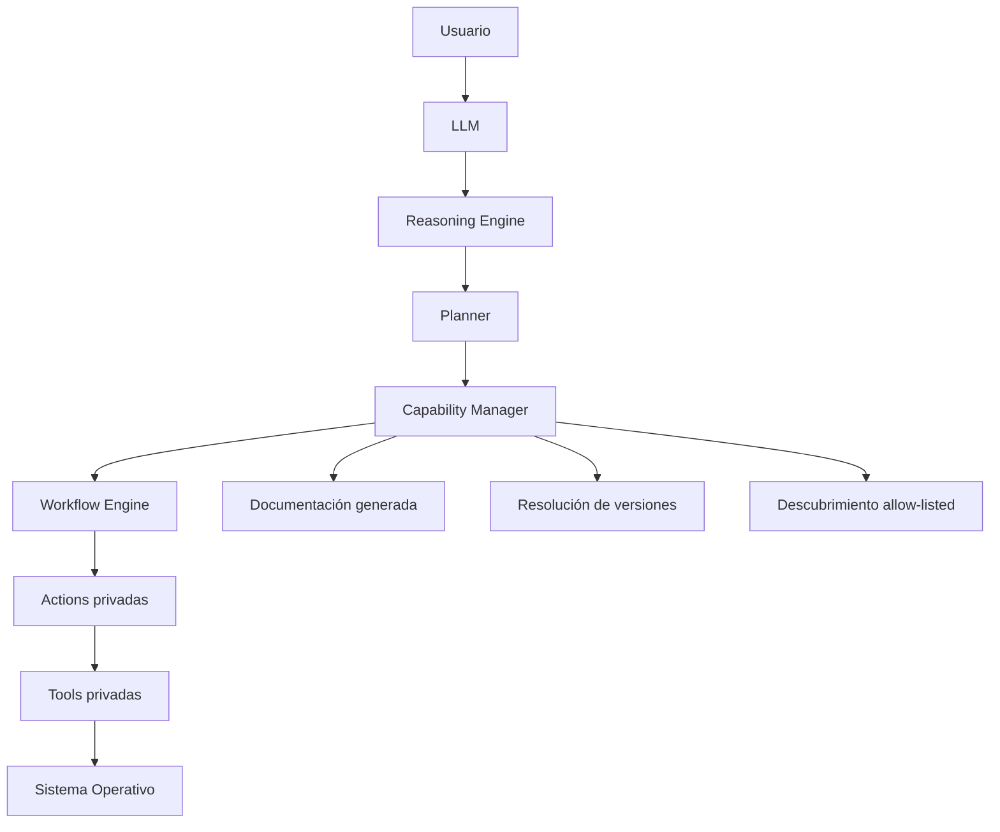

# ARES v2 — cierre de la frontera de extensibilidad

Esta iteración completa las fronteras que todavía acoplaban el núcleo a la única
Capability implementada. El objetivo no es añadir más operaciones del sistema,
sino asegurar que la segunda, décima o centésima Capability puedan instalarse sin
cambiar la API pública ni enseñar Actions o Tools al LLM.

## Cambios arquitectónicos

### Entrada tipada por Capability

Cada Capability declara un `input_model` de Pydantic. El Capability Manager:

1. genera automáticamente el JSON Schema público;
2. valida el payload con el modelo específico de la versión seleccionada;
3. entrega a la Capability una instancia ya validada;
4. verifica que el workflow use exactamente las Actions declaradas en sus metadatos.

La ruta de ejecución acepta un objeto JSON genérico. Ya no contiene campos
codificados para Disk Analysis. Un plugin nuevo puede declarar su propio contrato sin
modificar el router.

### Documentación automática

El catálogo publica un descriptor generado con:

- metadatos de la Capability;
- JSON Schema de entrada;
- plugin y versión proveedores;
- versión activa;
- dependencias, riesgo, permisos, postchecks, eventos y métricas.

Las Actions internas continúan excluidas de la representación pública.

### Versionado

El registro permite varias versiones compatibles de una misma Capability. La versión
semántica más alta queda activa de forma determinista, pero las versiones instaladas
pueden consultarse y una versión concreta puede seleccionarse internamente o mediante
el parámetro de versión de la API.

No se permiten duplicados de la misma pareja `capability_id + version` ni de la misma
pareja `plugin_id + version`.

### Descubrimiento de plugins

ARES conserva dos orígenes de confianza:

1. plugins built-in incluidos en la imagen firmada;
2. entry points de Python del grupo `ares.capabilities` explícitamente permitidos por
   la política `ARES_CAPABILITY_PLUGIN_ALLOWLIST`.

No se recorren directorios escribibles ni se importan módulos arbitrarios. Un bundle
instalado pero no allow-listed no se carga. Un nombre allow-listed ausente o inválido
impide iniciar el servicio, evitando una plataforma parcialmente configurada.

Ejemplo de declaración de un plugin externo:

```toml
[project.entry-points."ares.capabilities"]
my-signed-storage-plugin = "ares_storage_plugin:plugin_provider"
```

El objeto exportado puede ser una instancia de plugin o una fábrica sin argumentos que
devuelva una instancia con `manifest` y `capabilities()`.

### Planner independiente

Se incorpora un Planner determinista entre el Reasoning Engine y el Capability
Manager. El Planner:

- recibe el objetivo y referencias de evidencia;
- reutiliza las hipótesis del Reasoning Engine;
- resuelve dependencias de Capabilities en orden topológico;
- agrega evidencia requerida por todo el plan;
- produce un plan inmutable con IDs y versiones de Capabilities;
- nunca conoce Actions, Tools, comandos, rutas o argumentos del sistema operativo;
- no inicia la ejecución ni omite autorización o consentimiento.

Estados posibles:

- `ready`;
- `needs_evidence`;
- `stopped`.

## Flujo actualizado



## Endpoints añadidos o generalizados

- `GET /api/v1/capabilities`: catálogo activo con esquema de entrada.
- `GET /api/v1/capabilities/{id}`: documentación generada de una versión.
- `GET /api/v1/capabilities/{id}/versions`: versiones instaladas.
- `POST /api/v1/capabilities/{id}/executions`: payload JSON validado por la Capability.
- `POST /api/v1/planner/plan`: plan de Capabilities sin ejecución.

## Invariantes de seguridad

- El LLM solo observa Capabilities.
- El payload público no puede elegir Actions o Tools.
- La entrada se rechaza con `extra="forbid"` en el modelo de cada Capability.
- El workflow construido debe coincidir con las Actions declaradas en metadatos.
- Solo se cargan entry points explícitamente allow-listed.
- El registro se sella antes de aceptar solicitudes.
- Las dependencias circulares o ausentes impiden el arranque.
