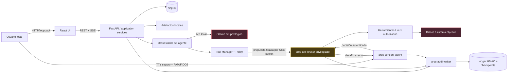
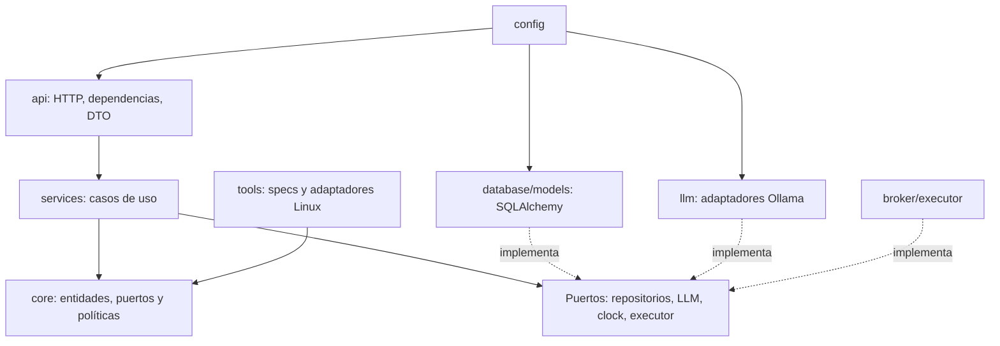
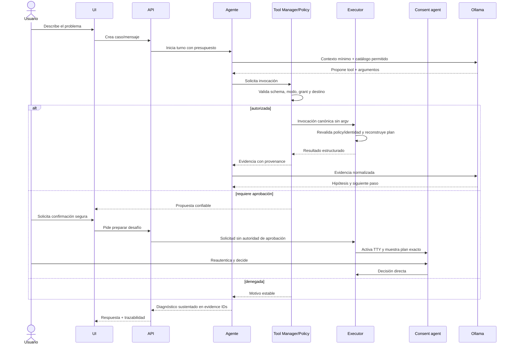

# Arquitectura de ARES

> Estado: arquitectura objetivo. El código actual implementa únicamente la base FastAPI/SQLite, configuración, correlación, logging seguro y salud. Los procesos, políticas y controles descritos como objetivo se incorporan por las puertas del roadmap.

## 1. Contexto y decisiones

ARES se ejecuta en un solo equipo, sin servicios externos y con recursos limitados. Por ello comienza como un **monolito modular** con adaptadores reemplazables, no como microservicios. La única separación de proceso obligatoria es la frontera de privilegios: una API comprometida no debe convertirse automáticamente en acceso root.

Las decisiones base son:

1. FastAPI coordina casos de uso, pero no ejecuta operaciones privilegiadas.
2. El dominio y las políticas no dependen de FastAPI, SQLAlchemy, Ollama ni comandos Linux.
3. SQLite es la fuente transaccional local; los artefactos grandes se almacenan como archivos con hash y metadatos en la base.
4. Ollama es un adaptador no confiable: propone; el servidor decide y valida.
5. Un broker local mínimo ejecuta exclusivamente planes construidos por herramientas registradas.
6. El frontend y la API comparten origen en producción para reducir superficie de CORS y autenticación.

Consulta [ADR-0001](adr/0001-modular-monolith.md), [ADR-0002](adr/0002-privilege-boundary.md), [ADR-0003](adr/0003-exact-approval.md), [ADR-0004](adr/0004-python-runtime.md), [ADR-0005](adr/0005-supply-chain-trust.md), [ADR-0006](adr/0006-audit-ledger.md) y [ADR-0007](adr/0007-ares-live-platform.md).

## 2. Vista de contenedores



Las respuestas del modelo, los logs, nombres de dispositivos, etiquetas de volúmenes, nombres de archivo y salidas de herramientas se consideran datos no confiables.

## 3. Capas y dependencias



Reglas:

- `core` no importa frameworks ni infraestructura.
- `services` depende de puertos, no de implementaciones.
- `api` traduce HTTP a casos de uso y nunca contiene reglas de negocio.
- `models` contiene persistencia; `schemas`, contratos de entrada/salida. No se reutilizan modelos ORM como respuestas HTTP.
- `tools` no recibe cadenas de comandos del agente. Cada implementación convierte argumentos estrictos en un plan interno.
- Las dependencias se conectan en la factoría de aplicación.

## 4. Estructura objetivo

```text
.
├── backend/
│   ├── src/ares/
│   │   ├── api/           # routers, dependencias HTTP, Problem Details
│   │   ├── config/        # settings y composición
│   │   ├── core/          # dominio, políticas, puertos, errores
│   │   ├── database/      # engine, sesiones, repositorios, migraciones
│   │   ├── llm/           # perfiles y cliente Ollama
│   │   ├── models/        # modelos SQLAlchemy
│   │   ├── schemas/       # Pydantic para API y eventos
│   │   ├── services/      # casos de uso/orquestación
│   │   └── tools/         # contrato, registry e implementaciones
│   └── tests/
├── executor/              # código de ares-tool-broker; proceso separado
├── consent-agent/         # confirmación por TTY fuera de la UI web/API
├── audit-writer/          # ledger HMAC y proyección de eventos
├── frontend/              # React + TypeScript + Tailwind + Vite
├── live-build/            # configuración reproducible de Debian Live
├── assets/                # iconos y recursos propios
├── scripts/               # automatización verificable
├── docs/
└── tests/                 # E2E, VM e integración de sistema
```

Los nombres solicitados (`llm`, `tools`, `core`, `database`, `api`, `services`, `models`, `schemas`, `config`) son paquetes dentro del backend; así mantienen una raíz de importación única (`ares`) y no contaminan el repositorio con módulos Python ambiguos.

## 5. Flujos principales

### Diagnóstico



### Reparación

Una reparación parte de un diagnóstico persistido. La API prepara una propuesta sin argv; el broker reconstruye el plan, captura precondiciones y genera un desafío. El consent agent obtiene aprobación de un solo uso en el TTY seguro. Después el broker revalida destino/condiciones, bloquea, ejecuta y llama a una tool verificadora independiente. `SUCCEEDED` exige verificación satisfactoria.

## 6. Consistencia y concurrencia

- Una transición de invocación y su evento de auditoría se persisten antes del efecto externo.
- El slice actual activa claves foráneas y `busy_timeout`. La fase de persistencia añadirá WAL cuando el medio lo permita y `synchronous=FULL` para transiciones críticas, con pruebas sobre el USB objetivo.
- Las escrituras se serializan en transacciones cortas; nunca se mantiene una transacción abierta mientras corre una herramienta.
- Un lock por identidad de recurso impide dos escritores y bloquea lecturas incompatibles durante una reparación.
- Las peticiones mutables aceptan `Idempotency-Key`.
- Tras un reinicio, una lectura interrumpida falla de forma explícita. Una mutación que estaba `RUNNING` o `VERIFYING` pasa a `RECONCILIATION_REQUIRED`, conserva el lock y nunca se reintenta automáticamente.

## 7. Observabilidad local

Cada petición recibe `request_id`; cada caso, turno, invocación, aprobación y artefacto tiene un UUID. Los logs operativos usan campos curados: no serializan mensajes/traces de excepciones ni parámetros SQL.

La arquitectura objetivo usa `ares-audit-writer`, fuera del proceso API, para secuenciar un ledger HMAC append-only. API, broker y agente de consentimiento emiten eventos críticos directamente. SQLite mantiene una proyección consultable, no la copia autoritativa. Esto detecta reescritura por una API comprometida, pero no un compromiso root ni rollback/truncación del almacenamiento completo sin un checkpoint anclado externamente o en TPM.

La observabilidad permanece local. La telemetría remota está deshabilitada y no es requisito para operar.

## 8. Evolución

La modularidad permite reemplazar SQLite por otra base o Ollama por otro runtime local sin cambiar el dominio. No se crea una abstracción anticipada para múltiples nodos: esa complejidad solo se introducirá si aparece un requisito real. El orden de implementación está en el [roadmap](roadmap.md).
