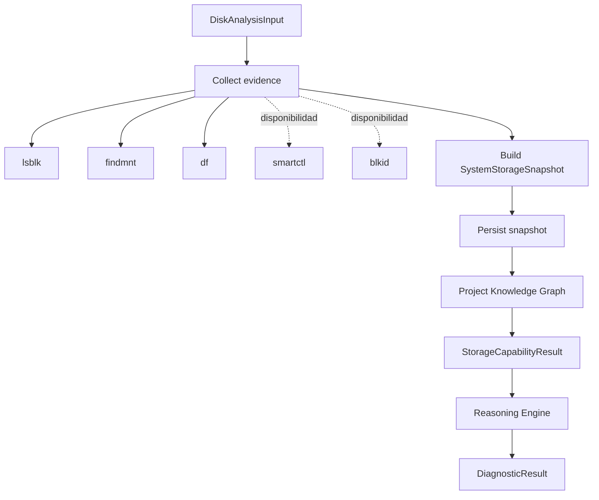

# Capability: `storage.disk-analysis`

## Estado

Implementada y verificada como primer vertical slice read-only de ARES.

```text
ID:       storage.disk-analysis
Version:  1.1.0
Category: storage
Risk:     low
Operation: observe
Mode:     read_only
Platform: Debian amd64 >= 13
```

Esta Capability analiza almacenamiento; **no repara ni modifica almacenamiento**.

## Objetivo

Construir una representación estructurada, reproducible y auditable del almacenamiento local y proporcionar evidencia suficiente para un diagnóstico inicial sin escribir en block devices.

## Flujo



El servicio de aplicación ejecuta el diagnóstico después de la Capability. Esto evita que las Actions mezclen hechos observados con inferencias.

## Input

```json
{
  "scope": "all_detected"
}
```

No hay input de dispositivo, path, executable, Action, Tool, flags o command. El modelo usa `extra="forbid"`.

## Output

`StorageCapabilityResult` contiene:

```text
snapshot: SystemStorageSnapshot
knowledge_graph:
  revision
  node_count
  edge_count
```

La API específica `/api/v1/storage/analyze` añade el `DiagnosticResult` generado a partir del snapshot.

## Tool Layer

### Ejecutables permitidos directamente

La composición oficial ejecuta únicamente invocaciones exactas y pasivas:

1. `lsblk` en JSON/bytes con columnas fijas;
2. `findmnt` en JSON/bytes con columnas fijas;
3. `df -B1` con columnas fijas.

Controles:

- `create_subprocess_exec`, nunca shell;
- argv fijo server-owned;
- stdin cerrado;
- cwd `/`;
- `LANG=C`, `LC_ALL=C`, PATH mínimo;
- timeout por probe;
- stdout/stderr acotados;
- binario regular root-owned y no escribible por otros;
- wrapper `ReadOnlyStorageProcessRunner` que rechaza cualquier argv no allowlisted.

### `smartctl` y `blkid`

Se modelan/parsan pero no se ejecutan sobre dispositivos desde FastAPI en este incremento.

```text
no instalado -> available=false, reason=tool_not_installed
instalado    -> available=false, reason=privileged_broker_required
```

La segunda condición indica que la próxima integración debe atravesar `ares-tool-broker` conforme a ADR-0002.

## Workflow

### 1. `collect-evidence`

Action: `storage.collect-evidence`.

Obtiene `StorageEvidence` desde probes pasivos. Si no hay devices intenta el inventario público generado al arranque. Si sigue sin evidencia de bloques, falla con `STORAGE_EVIDENCE_UNAVAILABLE`.

### 2. `build-snapshot`

Action: `storage.build-snapshot`.

Normaliza discos, particiones, filesystem, montajes, uso, OS y SMART a `SystemStorageSnapshot` y calcula `evidence_sha256`.

### 3. `persist-snapshot`

Action: `storage.persist-snapshot`.

Escribe el snapshot en el store privado antes de cualquier diagnóstico posterior.

### 4. `project-knowledge-graph`

Action: `knowledge.project-storage-snapshot`.

Actualiza nodos/relaciones y avanza la revisión del Knowledge Graph.

## SystemStorageSnapshot

El snapshot incluye:

- ID y timestamp UTC;
- hostname y session ID;
- fingerprint SHA-256 de evidencia normalizada;
- discos y hardware identity redactada/hasheada;
- particiones;
- filesystems;
- mounts y uso;
- sistemas operativos detectados desde mounts ya existentes;
- SMART disponible/no disponible;
- warnings/errors;
- disponibilidad de herramientas.

La ausencia de un dato no se rellena con una inferencia.

## Knowledge Graph

Relaciones implementadas:

```text
System contains Disk
Disk contains Partition
Partition formatted_as Filesystem
Partition mounted_at MountPoint
Disk contains OperatingSystem
Disk has_health_status SMARTStatus
```

El grafo es interno, atómico y versionado. No se usa una base de grafos externa.

## Diagnóstico

`ReasoningEngine.diagnose_storage()` produce un `DiagnosticResult` tipado. Reglas actuales:

- uso >= 85%: warning;
- uso >= 95%: error;
- SMART `passed=false`: error de salud sustentado en evidencia;
- SMART unavailable: limitación, nunca fallo de disco automático;
- filesystem no identificado: finding informativo + limitación;
- no se observan discos: warning de inventario.

La confianza disminuye cuando faltan herramientas/evidencia. `needs_more_evidence` indica si las limitaciones requieren otra observación.

`suggested_capabilities` queda vacío mientras esas Capabilities no existan; ARES no anuncia capacidades futuras como implementadas.

## Eventos

Eventos relevantes:

```text
capability.started
workflow.started
tool.execution.started
tool.execution.completed
storage.disk.detected
storage.partition.detected
storage.smart.analyzed
storage.snapshot.created
knowledge.graph.updated
workflow.completed
capability.completed
diagnostic.generated
```

Envelope v2:

```text
event_id
timestamp
correlation_id
session_id
source
event_type
payload
severity?
```

Los eventos de Tool contienen actor, reason, resource, tool, result y decision.

## Auditoría

El journal del Event Bus permite reconstruir la secuencia operacional de la ejecución y enlazarla con snapshot/diagnóstico. No contiene secretos ni stdout completo.

No se declara tamper-evident. El ledger criptográfico depende del futuro `ares-audit-writer` de ADR-0006.

## API

```text
GET  /api/v1/storage/disks
POST /api/v1/storage/analyze
GET  /api/v1/storage/snapshots/{id}
GET  /api/v1/diagnostics/{id}
```

También permanece disponible el endpoint genérico:

```text
POST /api/v1/capabilities/storage.disk-analysis/executions
```

Los endpoints delegan en Capability Manager/StorageAnalysisService; no contienen parsers ni reglas de diagnóstico.

## CLI

```bash
ares storage analyze
ares storage snapshot
ares storage snapshot <snapshot_id>
```

La CLI usa la misma composición y `StorageAnalysisService` que la API.

## UI

La sección Storage muestra únicamente datos proporcionados por backend:

- disco, modelo y capacidad;
- particiones;
- filesystem;
- mount y uso;
- SMART/reason;
- sistemas operativos;
- estado/confianza;
- findings/evidence/recommendations;
- warnings/limitations.

Mientras se ejecuta muestra `Analizando…`.

## Seguridad

Pruebas específicas cubren intento de ejecutar `smartctl`, `wipefs` y argv alternativo de `lsblk` por el runner read-only. La invocación se rechaza antes de llegar al delegate/subprocess.

No existen en esta Capability:

- reparticionado;
- formateo;
- reparación de filesystem;
- mount/unmount;
- recuperación de archivos;
- backup/clonación;
- instalación de paquetes;
- firewall;
- cambios de Windows;
- operaciones destructivas.

## Testing

Los tests no dependen de hardware real. En `Environment.TEST` los tests configuran `storage_process_probes_enabled=false` para la integración y usan fixtures/FakeRunner para Tool Layer.

Casos cubiertos incluyen:

- registration/discovery/version/output schema;
- parse de `lsblk`, `blkid`, `findmnt`, `df`, SMART;
- múltiples particiones y filesystem desconocido;
- tool ausente;
- SMART ausente/broker required;
- permiso insuficiente;
- timeout;
- comando fallido;
- fallback de inventario;
- rechazo read-only de Tool/argv no permitidos;
- snapshot/store;
- Knowledge Graph;
- Event Bus;
- API/Problem Details;
- diagnóstico;
- CLI.

## Limitaciones conocidas

- SMART/blkid privilegiados todavía no pasan por un broker operativo;
- el journal actual no es tamper-evident;
- no hay política de retención/GC de snapshots y diagnósticos;
- el `session_id` interno de eventos de workflow usa la correlación de ejecución cuando no existe un session context explícito;
- el detector de OS solo inspecciona `os-release` en filesystems ya montados; no monta volúmenes para descubrir sistemas offline;
- la identidad de dispositivos todavía no integra toda la revalidación udev/by-id/major:minor prevista para mutaciones.

## Próximo incremento recomendado

Implementar lectura privilegiada de SMART/blkid a través de `ares-tool-broker`, manteniendo `OBSERVE/READ_ONLY`. Esto valida la frontera de privilegios y la identidad de dispositivos sin introducir todavía una sola operación de escritura.
