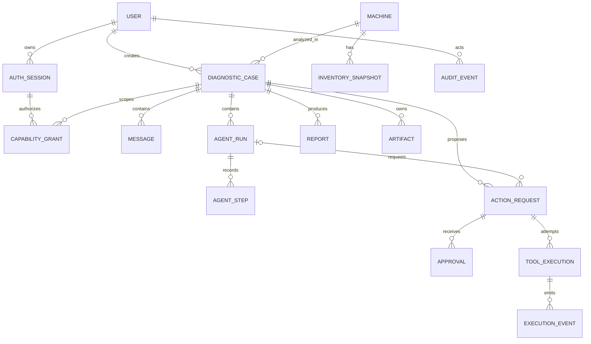

# Modelo de datos

> Estado: diseño objetivo. La base fundacional solo comprueba conectividad con SQLite; estas tablas llegarán con migraciones Alembic por fase.

## Convenciones

- Identificadores UUID en texto; timestamps UTC conscientes de zona.
- Claves foráneas activas y borrado restringido.
- Enums con restricciones y números de versión para concurrencia optimista.
- JSON solo para snapshots/resultados con schema versionado; los campos consultados con frecuencia son columnas.
- Argumentos canónicos, resultados, aprobaciones y eventos son inmutables.
- Salidas grandes viven en `ArtifactStore`; SQLite conserva URI interna, clasificación, tamaño y SHA-256.

## Entidades

| Tabla | Campos y responsabilidad |
|---|---|
| `users` | username normalizado único, password hash, rol, activo, timestamps, versión |
| `auth_sessions` | usuario, hash de token/CSRF, inicio, último uso, expiraciones, revocación y reautenticación |
| `capability_grants` | proyección del grant autoritativo del broker: identidad, sesión/caso, tools/versiones, usos, expiración, revocación y digest/proof |
| `machines` | fingerprint, hostname, plataforma y first/last seen |
| `inventory_snapshots` | machine, boot ID, inventario versionado, digest e invocación de origen |
| `diagnostic_cases` | machine, título, estado, modo, creador y timestamps |
| `messages` | caso, actor, contenido redactado, correlación y timestamp |
| `agent_runs` | caso, perfil/digest del modelo, versión de prompt, estado, presupuesto y conclusión |
| `agent_steps` | run, secuencia, tipo, justificación breve, estado y acción relacionada |
| `action_requests` | tool/version, args canónicos, plan/digest, efecto, riesgo, estado, política capturada y vencimiento |
| `approvals` | acción, humano, decisión, desafío/proof del consent agent, hashes vinculados, auth strength, comentario y expiración |
| `tool_executions` | acción, intento, manifest/bin digest, estado, tiempos y resultado estructurado |
| `execution_events` | secuencia durable para progreso, SSE y recuperación |
| `artifacts` | owner, ruta interna, MIME, clasificación, tamaño, SHA-256 y política de retención |
| `reports` | caso, tipo, versión, contenido/artefacto, digest y generador |
| `audit_events` | proyección SQLite consultable del ledger externo: secuencia, emisor, evento, objetivo, outcome, correlación y MAC/checkpoint |

## Relaciones

## Invariantes

- Solo una aprobación `APPROVED` vigente puede pasar una acción mutable a cola.
- Una observación solo pasa policy con un `capability_grant` autoritativo del broker, no revocado/vencido y aplicable a identidad, sesión, caso y `tool@version`; el broker actualiza su contador atómicamente antes de ejecutar y después proyecta el estado en SQLite.
- La aprobación debe contener los mismos hashes y destinos que la acción.
- Una acción aprobada no permite modificar argumentos; se crea una nueva.
- `SUCCEEDED` en una mutación implica una verificación `PASSED` asociada.
- Los eventos de una ejecución tienen secuencia única y creciente.
- Una sesión revocada no autoriza nuevos efectos, aunque un token siga en el cliente.
- Un reporte conserva los IDs de evidencia utilizados para poder reconstruir sus conclusiones.
- Los estados de una invocación usan exclusivamente el enum canónico de [Agente y herramientas](agent-and-tools.md#4-estados); no se inventan aliases en persistencia.

El ledger HMAC del `ares-audit-writer` es la fuente autoritativa para auditoría; esta tabla es una proyección reconstruible. API, broker y consent agent escriben por sockets separados. La clave no vive en la API y los eventos de ejecución/aprobación proceden directamente de sus procesos propietarios.

## SQLite

El slice actual usa un proceso web, `foreign_keys=ON` y `busy_timeout`. La fase de persistencia añadirá WAL cuando el medio lo soporte, transacciones cortas, `synchronous=FULL` para transiciones críticas y migraciones Alembic como única vía para modificar schema.

Al iniciar, una observación interrumpida termina `FAILED` con código de reinicio; una mutación que estaba `RUNNING`/`VERIFYING` pasa a `RECONCILIATION_REQUIRED`, conserva su lock y exige verificación. No se infiere un side effect por ausencia de errores ni se reintenta automáticamente.
