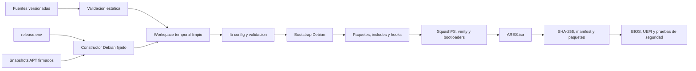
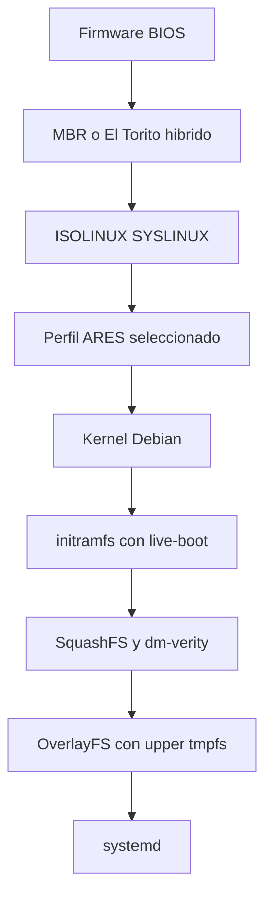
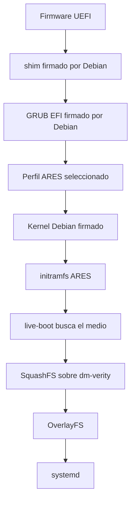
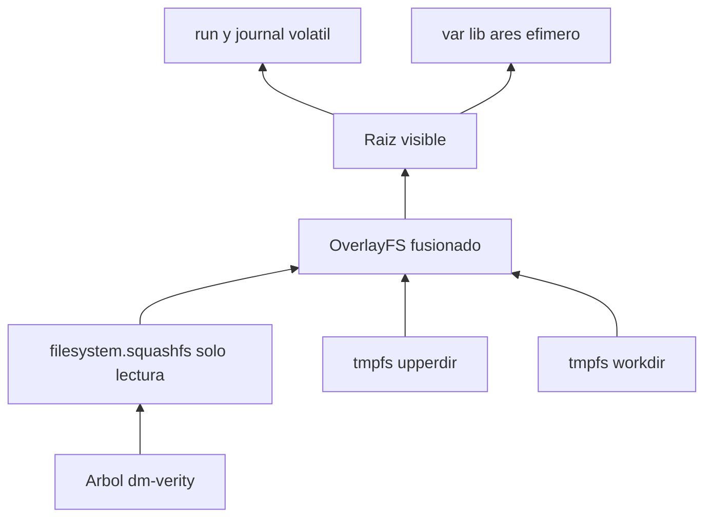
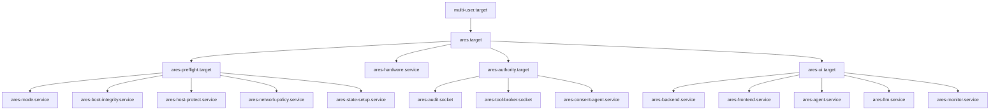
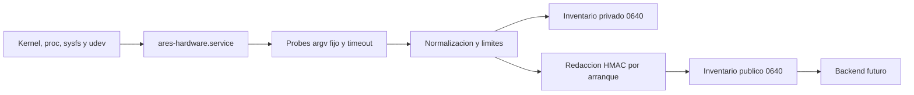

# Arquitectura de ARES OS Live

> Estado de Fase 2: infraestructura implementada y verificable. El repositorio ya contiene el constructor reproducible, configuración Debian Live, menús BIOS/UEFI, branding, preflight systemd, inventario inicial de hardware y una interfaz local provisional. La persistencia cifrada, la cadena de integridad completa, los paquetes del producto y las herramientas de reparación conservan puertas de aceptación pendientes; no se presentan como terminados.

## 1. Objetivo e invariantes

ARES OS es una imagen Debian 13 `trixie` Live para USB. No instala Debian ni modifica el equipo para poder arrancar. La imagen debe iniciar sin Internet, detectar hardware, levantar el plano de plataforma y mostrar una interfaz local sin intervención manual.

Invariantes de diseño:

- un solo comando construye la imagen y ningún paso interactivo modifica el chroot;
- el codename, snapshots, imagen del constructor y versión de `live-build` están fijados;
- el medio y la raíz inferior son de solo lectura; los cambios normales viven en un overlay de RAM;
- no se activa swap, resume, descubrimiento GPT, red, NTP ni automontaje por defecto;
- el usuario gráfico no tiene `sudo`, grupos de disco ni root interactivo;
- backend, agente, LLM y navegador nunca reciben privilegios de reparación;
- una herramienta futura solo podrá operar mediante el broker cerrado descrito en el modelo de seguridad;
- un fallo de un componente opcional degrada la plataforma, no abre permisos ni impide consultar el estado;
- la imagen no afirma una propiedad de seguridad que todavía no haya sido probada sobre el artefacto.

## 2. Estado implementado y frontera de esta fase

| Capacidad | Estado | Evidencia en el repositorio |
|---|---|---|
| Constructor Debian 13 fijado | Implementado | `live/Dockerfile.build`, `live/release.env` |
| ISO híbrida BIOS/UEFI | Configurada; requiere prueba del artefacto | `live/auto/config`, `config/bootloaders/` |
| Secure Boot Debian | Build obligatorio; estado parcial | `--uefi-secure-boot enable`, servicio de medición |
| SquashFS + dm-verity | Configurado; sin raíz de confianza completa | `--dm-verity` |
| Overlay efímero | Implementado por `live-boot` | `nopersistence`, `overlay-size=50%` |
| Persistencia LUKS2 ligada al USB | Diseño cerrado; activación aún bloqueada | `ares-state-setup` falla a efímero |
| Branding | Implementado y renderizado en build | `live/branding/`, Plymouth, GRUB, LightDM, XFCE |
| Inventario de hardware inicial | Implementado | `ares-hardware-inventory` y schema v1 |
| Hot-plug y SMART profundo | Diferido | roadmap OS3 |
| Servicios ARES futuros | Unidades y dependencias definidas; binarios ausentes se omiten | `ares-*.service` con `ConditionFileIsExecutable` |
| UI del producto | No implementada | Firefox muestra una página de plataforma provisional |
| Agente y herramientas de reparación | No implementados ni habilitados | fuera del alcance de Fase 2 |

## 3. Proceso de construcción



### 3.1 Entrada única

```bash
make build-iso
```

El resultado contractual es:

```text
iso/
├── ARES.iso
├── ARES.iso.sha256
├── ARES.build.json
└── ARES.packages.txt
```

Comandos auxiliares:

```bash
make validate
make validate-config
make inspect-iso
make test-iso
make verify-reproducible
```

`make validate` no usa red. `make validate-config` ejecuta la versión fijada de `live-build`. `make verify-reproducible` construye dos veces desde workspaces limpios y solo pasa si ambos ISO son idénticos byte a byte.

### 3.2 Entradas congeladas

`live/release.env` fija Debian 13.6, `trixie`, `amd64`, la imagen OCI por digest, `live-build=1:20250505+deb13u1`, snapshots de Debian y Security, `SOURCE_DATE_EPOCH`, compresión, versión y canal ARES.

Los snapshots se transportan por HTTP para no importar la CA TLS particular del host; la autenticidad continúa siendo obligatoria mediante `apt-secure`, `InRelease` y hashes de paquetes. Un release debe conservar también los digests de índices y paquetes en su procedencia.

### 3.3 Aislamiento del build

El checkout se monta de solo lectura. `live-build` trabaja en un directorio temporal y solo `iso/` es salida. El contenedor necesita montajes/chroot y por eso usa privilegios amplios; no debe ejecutarse sobre ramas no confiables. El release oficial se construirá dentro de una VM Debian 13 desechable y dedicada, usando el mismo constructor fijado. El contenedor es una vía reproducible de desarrollo, no una frontera de seguridad contra hooks maliciosos.

La red es necesaria para poblar el snapshot durante el build; la imagen resultante no necesita ni intenta usar Internet. El hito OS1 cerrará un mirror local firmado para construir también sin egress.

### 3.4 Reproducibilidad honesta

Hay tres niveles distintos:

1. **Repetible**: mismas fuentes y versiones producen funcionalmente la misma imagen.
2. **Reproducible medido**: dos builds limpios producen el mismo SHA-256.
3. **Release autenticado**: el artefacto reproducible tiene manifest, SBOM, firmas y procedencia verificables.

La configuración apunta al segundo nivel, pero ningún release se etiquetará “reproducible” hasta ejecutar la comparación doble. Las firmas externas se aplican después porque pueden incorporar tiempo.

## 4. Estructura del repositorio Live

```text
live/
├── Dockerfile.build          # entorno de build fijado
├── release.env               # versiones y snapshots autoritativos
├── auto/                     # entrypoints estándar de live-build
├── config/                   # árbol canónico consumido por live-build
│   ├── bootloaders/          # GRUB, ISOLINUX/SYSLINUX y temas
│   ├── hooks/live/           # cambios chroot y policy checks
│   ├── includes.binary/      # contenido visible en el medio
│   ├── includes.chroot/      # overlay versionado del root filesystem
│   └── package-lists/        # paquetes por responsabilidad
├── branding/                 # fuente única de marca y SVG
├── artwork/                  # política de recursos renderizados
├── boot/                     # contrato de perfiles y parámetros
├── hooks/                    # guía de autoría de hooks
├── includes/                 # guía de includes y ownership
├── overlay/                  # contrato del filesystem sobrepuesto
├── packages/                 # staging futuro de .deb y packs firmados
└── systemd/                  # mapa y reglas de unidades
scripts/                      # build, render, validación e inspección
iso/                          # artefactos finales ignorados por Git
docs/                         # diseño, runbook, roadmap y Mermaid
```

El árbol real de `live-build` permanece bajo `live/config`; no se duplica contenido solo para satisfacer una taxonomía visual. Los directorios auxiliares explican dónde vive cada responsabilidad. En un release posterior, la configuración productiva migrará de `includes.chroot` al paquete firmado `ares-live-config.deb`.

## 5. Cadena de arranque

### 5.1 BIOS Legacy



BIOS no tiene Secure Boot. En una ISO híbrida de `live-build`, el cargador correcto para Legacy es ISOLINUX/SYSLINUX; no se documenta falsamente GRUB como eslabón BIOS. El directorio de plantilla `grub-pc/` de Debian se usa para generar el menú GRUB del camino EFI aunque conserve ese nombre histórico.

### 5.2 UEFI y Secure Boot



`--uefi-secure-boot enable` hace fallar el build si no puede producir el camino firmado; no se usa `auto`. Sin embargo, shim, GRUB y kernel firmados por Debian no autentican por sí solos el initramfs personalizado, la línea de kernel ni la raíz verity de ARES.

| Estado | Significado |
|---|---|
| `ENFORCED_FULL` | UKI/cmdline/initrd autenticados y root hash firmado; meta futura |
| `ENFORCED_PARTIAL` | shim/GRUB/kernel firmados, cadena ARES incompleta |
| `DISABLED` | UEFI presente con Secure Boot desactivado |
| `UNAVAILABLE` | arranque BIOS |
| `FAILED` | verificación obligatoria fallida; autoridad no inicia |

La build de desarrollo solo puede declarar `ENFORCED_PARTIAL`. OS7 añade UKI firmada y enlaza el root hash verity con la cadena de confianza.

### 5.3 initramfs, live-boot y root

`boot=live` activa `live-boot`. El initramfs localiza `/live` en el medio de solo lectura, monta `filesystem.squashfs`, crea upper/work en tmpfs y entrega `/` fusionado. `live-config` crea el usuario `ares`, configura locale, teclado, zona horaria y autologin gráfico.

Parámetros comunes:

```text
nopersistence noresume
systemd.gpt_auto=0 rd.systemd.gpt_auto=0 systemd.swap=0
live-config.nocomponents=sudo,policykit
nottyautologin overlay-size=50%
dm-verity-oncorruption=restart
```

## 6. Filesystem Live, overlay y almacenamiento



- **lowerdir**: SquashFS comprimido, inmutable y medido por dm-verity;
- **upperdir/workdir**: tmpfs con límite del 50 % de RAM;
- **merged root**: vista escribible durante la sesión;
- **journal**: volátil, máximo 64 MiB;
- **estado ARES**: efímero salvo persistencia validada;
- **medio Live**: nunca destino de una reparación.

El agotamiento de overlay debe degradar la UI y reservar espacio para auditoría; nunca habilita swap ni escrituras al host. Esa reserva es criterio de OS4.

## 7. Modos y persistencia

Los menús presentan experiencias, pero internamente hay ejes independientes:

| Eje | Valores |
|---|---|
| Operación | `live`, `forensic`, `recovery` |
| Retención | `ephemeral`, `persistent` |
| Red | `off`, `scoped` |
| Confianza de boot | estados de integridad anteriores |
| Techo futuro | `READ_ONLY`, `REPAIR`, `ADVANCED` |

Un parámetro de boot es una solicitud, no autoridad. El broker futuro obtendrá el techo de política root-owned y solo podrá restringirlo.

| Entrada | Comportamiento | Ventajas | Limitaciones |
|---|---|---|---|
| Live efímero | overlay y estado en RAM | reinicio limpio | pierde casos y reportes |
| Persistencia cifrada | datos ARES seleccionados en LUKS2 del mismo USB | conserva ledger, reportes y packs | requiere provisionador y clave |
| Forense solo lectura | efímero, red off, bloques marcados RO | minimiza escrituras | no es peritaje certificado sin write blocker físico |
| Recuperación | efímero; prepara políticas futuras | intervención controlada | hoy no habilita tools ARES |

### 7.1 Persistencia segura

No se activa el parámetro genérico `persistence`: una etiqueta en un disco anfitrión no demuestra pertenencia al USB. El activador exigirá:

1. LUKS2 hija del mismo dispositivo físico que el medio Live;
2. PARTUUID y UUID LUKS registrados por el provisionador;
3. marcador ARES, versión compatible y coincidencia única;
4. passphrase o recovery key; TPM2/FIDO2 solo adicionales;
5. `nodev,nosuid,noexec`, cuotas y `BindsTo=` al dispositivo;
6. solo ledger, reportes, configuración y packs;
7. nunca overlay completo de `/`, `/etc` o `/home`.

Un volumen ausente, duplicado, lleno, corrupto o futuro cae a efímero/solo lectura. Nunca se formatea, repara o migra automáticamente. La implementación actual aplica ese fallo cerrado: una solicitud persistente reporta degradación y sigue efímera hasta existir el provisionador confiable.

## 8. systemd y servicios



### 8.1 Activas en Fase 2

| Unidad | Responsabilidad |
|---|---|
| `ares-mode.service` | normaliza modo, retención y red |
| `ares-state-setup.service` | estado efímero y persistencia fail-closed |
| `ares-boot-integrity.service` | mide firmware, Secure Boot y verity |
| `ares-host-protect.service` | elimina swap y refuerza RO forense |
| `ares-network-policy.service` | registra política; un generador enmascara red off |
| `ares-hardware.service` | inventarios privado y redactado |
| `ares-kiosk.service` | Firefox local con fallback provisional |

No se usa `systemd-udev-settle`; OS3 añadirá hot-plug incremental.

### 8.2 Preparadas, no simuladas

`ares-backend`, `ares-agent`, `ares-frontend`, `ares-llm`, `ares-monitor`, `ares-audit`, `ares-tool-broker`, `ares-consent-agent` y `ares-update` usan `ConditionFileIsExecutable`. Sin paquete, systemd las omite: no hay procesos falsos.

- broker/consentimiento requieren audit writer y `After=` explícito;
- API solo quiere auditoría/hardware y conserva UI degradada;
- LLM es opcional y se mata antes ante OOM;
- frontend espera readiness local con reintentos acotados;
- update no tiene timer/red y solo procesa packs offline;
- integridad fallida detendrá autoridad con handler explícito en OS7.

## 9. Usuario Live y permisos

`live-config` crea `ares` para autologin gráfico, limitado a `audio`, `video` y `ares-operators`. Nunca pertenece a `netdev`, `disk`, `sudo`, `wheel`, `adm`, `input` o `systemd-journal`. Se desactivan sudo/policykit de `live-config`; root queda bloqueado.

Cuentas separadas: `ares-api`, `ares-agent`, `ares-llm`, `ares-monitor`, `ares-update`, `ares-hardware`, `ares-audit`, `ares-broker` y `ares-consent`. El navegador/API no ven dispositivos. El inventario es un oneshot root endurecido, argv fijo y sin interfaz desde la API. El broker futuro lanzará tools en unidades transitorias con dispositivo, capabilities, mounts y límites exactos.

## 10. Hardware y drivers



```text
/run/ares/hardware/private/inventory-v1.json
/run/ares/hardware/public/inventory-v1.json
/usr/share/ares/schemas/hardware-v1.schema.json
```

| Dominio | Fuente | Regla |
|---|---|---|
| CPU/RAM | `lscpu`, `/proc/meminfo`, DMI sysfs | seriales solo privados |
| GPU/PCI | `lspci`, driver sysfs | no inicializa CUDA/OpenGL |
| Discos | `lsblk`, `findmnt` | no monta ni activa swap |
| SMART | `smartctl --scan` | no `--scan-open`, tests ni wake; salud diferida |
| NVMe | `nvme list -o json` | lectura con timeout |
| Red/Wi-Fi | `ip -j`, `iw dev`, `rfkill` | no DHCP ni escaneo SSID |
| Bluetooth/USB | BlueZ, `lsusb` | no discovery/pairing; strings hostiles |
| EFI | efivars, `mokutil`, `efibootmgr` | nunca modifica NVRAM/MOK |
| Batería/sensores | sysfs, `sensors -j` | nunca `sensors-detect` |
| Drivers | `lsmod`, sysfs | no carga módulos por prueba |

Estados por probe: `ok`, `partial`, `unavailable`, `timeout`, `permission_denied`, `unsupported`, `skipped_policy`. Salida UTF-8, sin NaN, estable, acotada y atómica con `fsync`/`rename`; datos sensibles se vuelven HMAC efímero en la vista pública.

Firmware inicial: AMD/Intel graphics, IWLWiFi, Realtek, Atheros, Broadcom moderno, SOF y microcode. La autodetección de firmware de `live-build` está desactivada: solo entra la lista curada y fijada al snapshot. Los instaladores B43 heredados se excluyen porque descargan blobs desde GitHub/OpenWrt durante `postinst`, fuera de APT y de la procedencia reproducible. No hay DKMS ni drivers propietarios. Hardware posterior a Trixie puede requerir backports y una matriz PCI/USB → módulo → firmware → licencia → tamaño.

## 11. Networking

Por defecto:

- se enmascaran NetworkManager, wpa_supplicant, Bluetooth, resolved y timesyncd;
- no hay perfiles y `no-auto-default=*` impide crearlos;
- no hay DHCP, NTP, captive portal, DoH ni connectivity checks;
- X11 usa `-nolisten tcp`;
- Firefox no tiene telemetría, estudios, Pocket, update, predicción o contenido remoto;
- servicios de producto solo escuchan loopback y niegan egress.

En esta fase, incluso una solicitud `ares.network=scoped` degrada explícitamente a `off`: el broker de conectividad aún no existe y no se simula. En un hito posterior, `network.diagnose` podrá abrir una regla nftables temporal por IP, protocolo, bytes y tiempo. Aceptación actual: reglas `input`, `output` y `forward` con política `drop`, solo loopback permitido y cero paquetes en boot/uso normal offline.

## 12. Seguridad y fallos

| Amenaza | Control |
|---|---|
| Build mutable | digest OCI, snapshots, codename y live-build fijados |
| Paquete alterado | `apt-secure`, índices firmados y hashes |
| Medio corrupto | checksum externo y dm-verity |
| Bootloader/kernel alterados | Secure Boot Debian obligatorio en UEFI |
| Userspace alterado | meta UKI + root hash firmado; pendiente |
| Escritura accidental | no swap/resume/GPT auto/automount, overlay RAM, RO forense |
| Persistencia falsa | identidad del mismo USB, LUKS2 y marcador; genérica off |
| API comprometida | sin root/dispositivos; broker separado |
| Datos hostiles | normalización, límites, JSON y redacción |
| Exfiltración | red off, loopback y políticas Firefox |

Firmar el ISO, Secure Boot, dm-verity, LUKS2 y el ledger resuelven amenazas distintas.

- audit writer caído: no hay nuevos grants/tools, pero sí consulta;
- persistencia inválida: efímero, sin fsck/migración;
- USB retirado: congelar operaciones y apagar; `toram` exige verificación/RAM;
- destino retirado: punto seguro y reconciliación por identidad;
- OOM: LLM cae antes que auditoría/broker;
- verity/firma obligatoria inválida: no inicia autoridad/recovery;
- reinicios limitados, nunca bucles infinitos.

## 13. Distribución offline

| Componente | Formato |
|---|---|
| Backend Python 3.12 | `.deb` con runtime `/opt/ares/runtime`, lock y hashes |
| Frontend | assets Vite compilados; sin Node/npm |
| Agente/broker | `.deb` firmados y manifiesto root-owned |
| LLM | runtime fijado, solo loopback |
| Modelos | packs firmados con digest, licencia y requisitos |
| Herramientas | paquetes Debian fijados, habilitados por familia |
| Documentación | local en `/usr/share/doc/ares-os` |
| Drivers | paquetes Debian y licencias inventariadas |
| Updates | APT temporal desde pack local firmado, sin timer de red |

Fase 2 no incluye modelo ni simula uno. El perfil full se habilitará con un pack redistribuible verificado. CPU será garantizado; GPU opcional.

## 14. Rendimiento

- sin `network-online.target` ni `systemd-udev-settle`;
- preflight/inventario paralelos por systemd;
- cuatro workers de probes con timeout;
- LLM no bloquea API/UI;
- sin índices APT, compiladores ni caches npm/pip en ISO;
- Xfce explícito, no `task-xfce-desktop`;
- XZ nivel 6 prioriza tamaño; Zstd se decidirá con mediciones;
- modelo después de UI, con límites de memoria/OOM;
- SMART profundo y sensores lentos asíncronos.

Cada ajuste se medirá con `systemd-analyze`, tamaño SquashFS, peak RSS, tiempo hasta UI y hardware real.

## 15. Pruebas y aceptación

Validación estática: shell/Python/JSON/XML/systemd; paquetes resolubles; paridad GRUB/SYSLINUX; sin `stable`, APT inseguro, `curl | sh`, claves privadas o repos móviles; `lb config --validate` en Debian fijado.

Artefacto: SHA-256; El Torito BIOS/EFI y MBR/GPT híbrido; firmas esperadas; SquashFS + verity; manifest; dos builds idénticos.

VM: SeaBIOS, OVMF y Secure Boot con claves inscritas; CD/USB; sin NIC y RAM limitada; discos canario sin cambios; sin swap/montajes host/listeners externos/egress; fault injection.

Hardware físico: USB 2/3, SATA/NVMe/bridges, BIOS/UEFI diversos, GPU/CPU, Wi-Fi, batería y variantes de CA Secure Boot.

## 16. Referencias primarias

- [live-build de Debian 13](https://manpages.debian.org/trixie/live-build/live-build.7.en.html)
- [`lb_config(1)` de Trixie](https://manpages.debian.org/trixie/live-build/lb_config.1.en.html)
- [`live-boot(7)` de Trixie](https://manpages.debian.org/trixie/live-boot-doc/live-boot.7.en.html)
- [`live-config(7)` de Trixie](https://manpages.debian.org/trixie/live-config-doc/live-config.7.en.html)
- [Secure Boot en Debian](https://wiki.debian.org/SecureBoot)
- [Verificación de imágenes Debian](https://www.debian.org/CD/verify.en.html)

El roadmap con objetivos, entregables, aceptación, riesgos y dependencias está en [ares-os-roadmap.md](ares-os-roadmap.md). El procedimiento está en [live-build-runbook.md](live-build-runbook.md).
