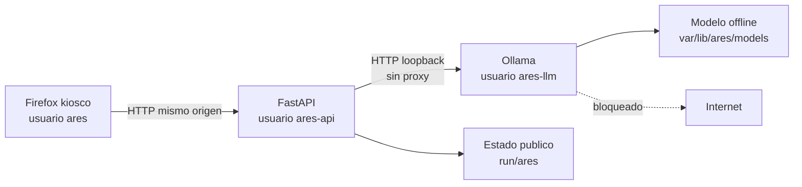

# Primera integración de IA local

## Alcance

La primera vertical de IA de ARES conecta la interfaz con un runtime Ollama
local sin habilitar agente, herramientas ni reparaciones. El sistema sigue
siendo útil si no hay runtime o modelo: backend, inventario y UI arrancan y
reportan el estado degradado.

## Flujo implementado

1. `ares-ui.target` inicia `ares-backend.service`.
2. Uvicorn escucha exclusivamente en `127.0.0.1:8000`.
3. El backend sirve los assets y API bajo el mismo origen.
4. `GET /api/v1/ai/status` consulta `GET /api/tags` de Ollama.
5. La UI solo habilita chat cuando el modelo configurado aparece instalado.
6. `POST /api/v1/assistant/chat` añade un prompt de sistema propiedad del
   servidor y llama `POST /api/chat` con streaming desactivado.
7. No se envía el campo `tools`; una respuesta con `tool_calls` se rechaza.

## Fronteras de seguridad

- `ARES_AI_BASE_URL` solo acepta HTTP en `127.0.0.1`, `::1` o `localhost`;
- el cliente ignora proxies de entorno y no sigue redirecciones;
- backend y runtime tienen `IPAddressDeny=any` y
  `IPAddressAllow=localhost`;
- nftables permite loopback y deniega egress por defecto;
- máximo 12 mensajes, 4.000 caracteres por mensaje y 16.000 por contexto;
- respuesta máxima de 16.000 caracteres y 768 tokens solicitados;
- el endpoint conversacional no recibe terminal, credenciales, devices,
  Actions, Capabilities ejecutables ni API de Tools;
- el modelo no participa en readiness del backend;
- las respuestas se muestran como texto, nunca como HTML.

Estas medidas reducen superficie, pero el texto de un LLM no es evidencia ni
autoridad. El modelo puede equivocarse. ARES no debe presentar una conclusión
como verificada hasta enlazarla con datos estructurados y una política
determinista.

El núcleo ARES v2 implementa ese enlace fuera del LLM mediante Reasoning Engine,
Capability Manager y Workflow Engine. La capability Disk Analysis puede
ejecutarse desde la interfaz, pero el chat no puede invocarla. Consulta
[`architecture-v2-capabilities.md`](architecture-v2-capabilities.md).

## Distribución offline

El contrato de staging está en `live/models/README.md`. Un paquete opcional
contiene el runtime, el almacén de modelos, metadatos `BUNDLE.json` y
`SHA256SUMS`. El constructor valida arquitectura, procedencia y campos de
licencia; rechaza symlinks, archivos no declarados, archivos declarados
ausentes y hashes incorrectos; y normaliza la propiedad al usuario aislado
`ares-llm`. No existe descarga en boot.

La configuración inicial apunta a
`qwen2.5:1.5b-instruct-q4_K_M` por su tamaño contenido, pero los pesos no se
incluyen aún. Antes de distribuirlos se debe fijar:

- fuente y versión exactas;
- digest de runtime, manifiestos y blobs;
- licencia y NOTICE redistribuibles;
- presupuesto mínimo de RAM/CPU y tiempo de primera respuesta;
- evaluación en español y pruebas de instrucciones adversarias;
- SBOM y procedencia del pack.

## Estados observables

| Estado | UI | API/backend |
|---|---|---|
| `ready` | chat habilitado | Ollama responde y el modelo está listado |
| `model_missing` | chat deshabilitado | runtime activo, tag ausente |
| `runtime_unavailable` | chat deshabilitado | runtime ausente, caído o inválido |

Errores de generación se publican con Problem Details y códigos estables; no se
devuelven stack traces ni cuerpo crudo de Ollama.

## Siguiente puerta

La siguiente iteración debe producir un pack offline firmado y evaluado. Luego
se agregará recuperación aumentada por evidencia (RAG local) sobre documentación
ARES y el inventario público. Las herramientas y mutaciones permanecerán fuera
del modelo y detrás del broker/consentimiento independiente.

Referencias primarias:

- [Introducción a la API local de Ollama](https://docs.ollama.com/api/introduction)
- [Endpoint de chat de Ollama](https://docs.ollama.com/api/chat)
- [Preguntas frecuentes de Ollama](https://docs.ollama.com/faq)
